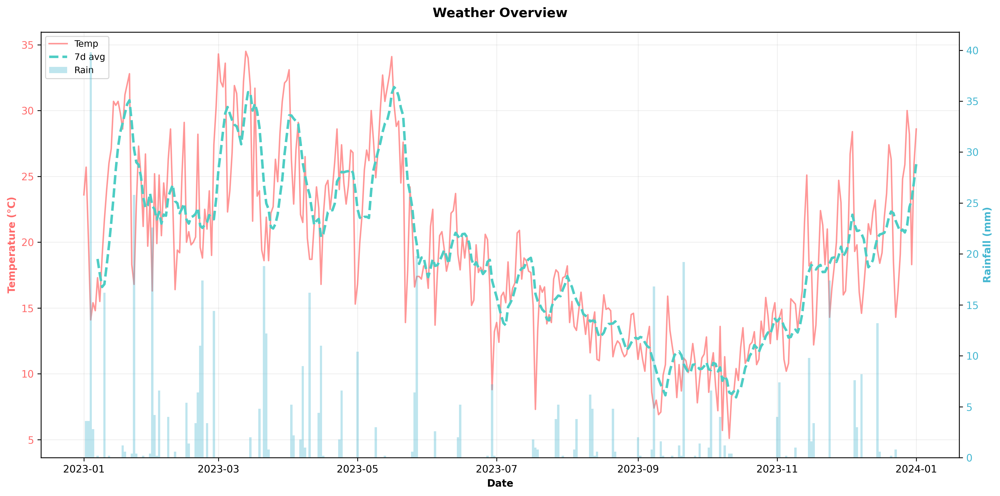

# Weather Trend Visualizer

## Project Summary

The **Weather Trend Visualizer** is a professional data analysis tool designed to extract insights from historical weather data. This project combines temperature trends and rainfall patterns to help identify seasonal patterns and climate anomalies.

The tool generates a comprehensive dual-axis visualization that displays:
- **Daily temperature values** and a **7-day moving average** for trend smoothing
- **Rainfall data** as bar charts on a secondary axis
- **Statistical insights** including hottest days, monthly comparisons, and precipitation totals

## Features

✨ **Data Analysis & Calculations**
- Loads weather data from CSV format with robust error handling
- Calculates 7-day moving averages using NumPy for trend smoothing
- Generates key statistics including:
  - Hottest day of the year (date and temperature)
  - July vs. annual average temperature comparison
  - Total annual rainfall

📊 **Professional Visualization**
- Dual-axis chart for simultaneous temperature and rainfall display
- Color-coded elements (Red for temperature, Teal for moving average, Blue for rainfall)
- Dashed line for 7-day moving average (distinct visual differentiation)
- Grid lines for easy reading
- High-resolution output (300 DPI)

🔍 **Console Reporting**
- Displays all calculated statistics in a formatted report
- Clear labeling of key findings
- Easy-to-read output with emoji indicators

## Requirements

- Python 3.7+
- pandas
- NumPy
- Matplotlib

## Installation

1. **Clone or navigate to the project directory:**
   ```bash
   cd weather-trend-visualizer
   ```

2. **Install dependencies:**
   ```bash
   pip install -r requirements.txt
   ```

## Data Format

The `weather.csv` file should contain the following columns:

| Column | Description | Unit |
|--------|-------------|------|
| `Temp3pm` | Afternoon temperature reading | °C |
| `Rainfall` | Daily precipitation | mm |
| *(Optional) `Date`* | Date of the observation | YYYY-MM-DD |

**Note:** If a Date column is not present, the script assumes sequential daily data starting from January 1st.

### Example CSV Structure:
```
MinTemp,MaxTemp,Rainfall,Temp9am,Temp3pm,...
8,24.3,0,14.4,23.6,...
14,26.9,3.6,17.5,25.7,...
13.7,23.4,3.6,15.4,20.2,...
```

## Usage

Run the analysis script from the project directory:

```bash
python weather_analyzer.py
```

### Output:

1. **Console Report:**
   ```
   ==============================================================
   WEATHER ANALYSIS REPORT
   ==============================================================
   
   📊 Hottest Day of the Year:
      Date: July 15, 2023
      Temperature: 32.8°C
   
   🌡️  Temperature Comparison:
      Annual Average Temperature: 21.45°C
      July Average Temperature: 26.83°C
      ✓ Yes, July was 5.38°C hotter than the annual average!
   
   💧 Total Annual Rainfall:
      1245.3 mm
   ==============================================================
   ```

2. **Visualization:** A high-quality PNG file saved to `plots/weather_overview.png`

## Generated Visualization

The output chart displays:



- **Left Axis (Temperature):**
  - Solid red line: Daily temperature values
  - Dashed teal line: 7-day moving average for trend clarity

- **Right Axis (Rainfall):**
  - Blue bars: Daily rainfall amounts

## Project Structure

```
weather-trend-visualizer/
├── weather.csv                 # Input data file
├── weather_analyzer.py         # Main analysis script
├── requirements.txt            # Python dependencies
├── README.md                   # This file
└── plots/
    └── weather_overview.png    # Generated visualization
```

## Error Handling

The script includes comprehensive error handling for:
- Missing or inaccessible CSV files
- Malformed CSV data
- Missing required columns
- Invalid date formats

All errors are reported with clear messages to help with troubleshooting.

## Technical Details

### Moving Average Calculation
The 7-day moving average is calculated using NumPy's `convolve` function with a uniform kernel:
```python
moving_avg = np.convolve(temperature_values, np.ones(7) / 7, mode='valid')
```

This smooths out daily fluctuations to reveal underlying temperature trends.

### Temperature Data Source
The script uses `Temp3pm` (afternoon temperature) as the representative daily temperature value, as it typically represents the warmest point of the day.

## Customization

You can modify the script to:
- Change the moving average window from 7 days to a different period
- Adjust colors and styling in the visualization
- Analyze different months or custom date ranges
- Export statistics to a CSV file

## Requirements Details

- **pandas 2.0.3**: Data loading and manipulation
- **NumPy 1.24.3**: Moving average calculations
- **Matplotlib 3.7.2**: Visualization and chart generation

## Author

Created as a professional weather data analysis tool.

## License

This project is open-source and available for educational and professional use.
